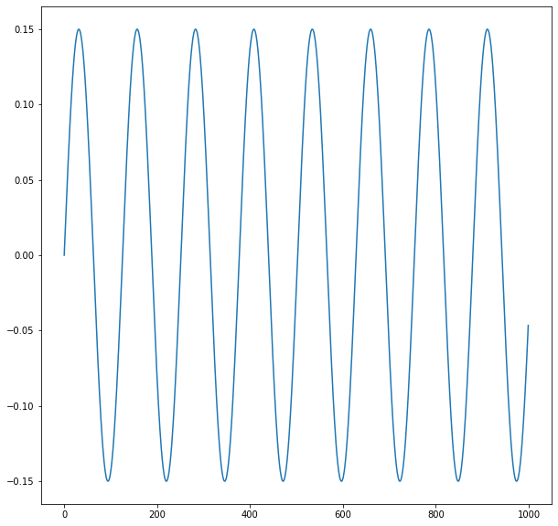
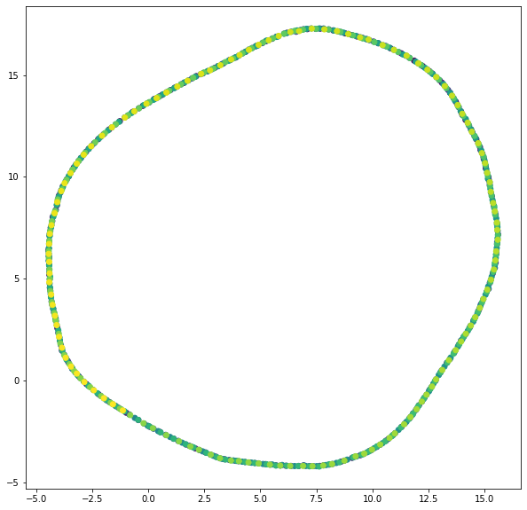
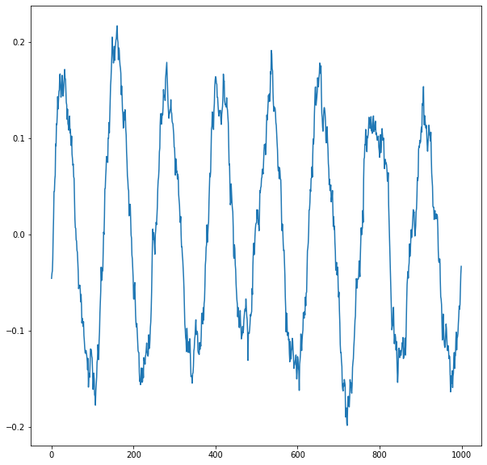
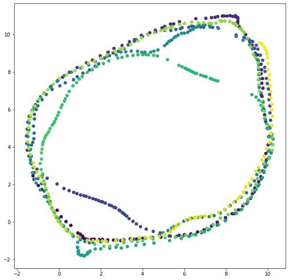
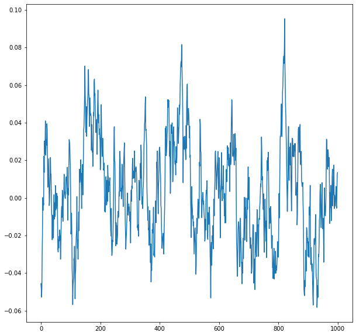
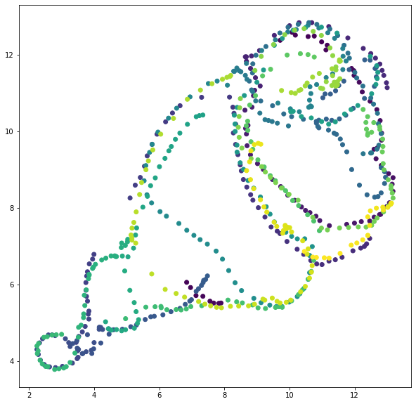
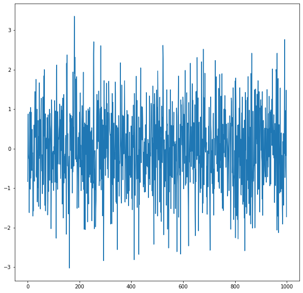
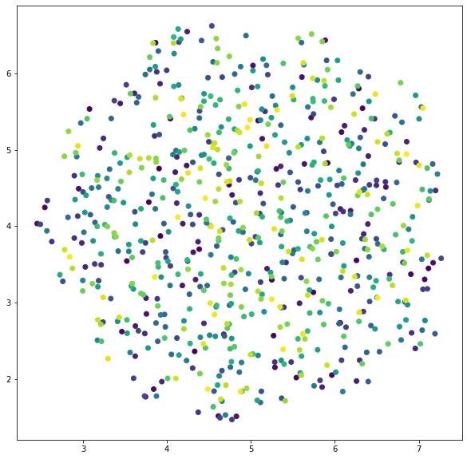

[](http://quantlet.de/)

## [](http://quantlet.de/) **UMAP_sim_ts** [](http://quantlet.de/)

```yaml

Name of Quantlet: 'UMAP_sim_ts'

Published in: 'DEDA'

Author: 'Lucas Valentin Umann'

Description: 'Simulates time series data (AR1, sine curve, white noise) and applies the UMAP VizTech to reflect local and global structure of the data. '

Keywords: 'UMAP, VizTech, AR1, Dimension Reduction, Time Series'

```

















### [IPYNB Code: UMAP_sim_ts.ipynb](UMAP_sim_ts.ipynb)


automatically created on 2021-04-18